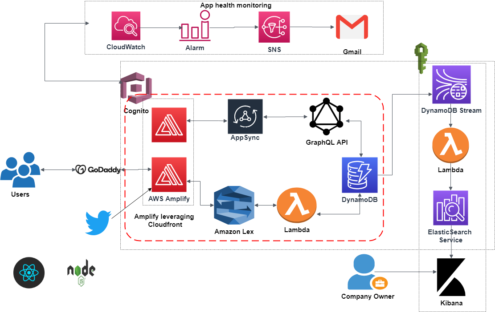

## **SAVE OUR EARTH**
===================

Climate change is a big, alarming issue now-a-days and it is primarily because of carbon emission. With this project we aims to make us aware of the amount of carbon emission (in terms of CO2 equivalent) we do on our part in terms of our daily purchases and food choices and suggest them with choices that could make a change. This is a cloud native serverless application using AWS. Frontend of this project was bootstrapped with [Create React App](https://github.com/facebook/create-react-app). Backend is using nodejs.

### **Services Used**
* Cognito							:		Authentication & Authorization
* Lambda  						:		Serverless application
* AWS Amplify  					:		CI/CD deployment &  hosting                 
* Amazon Lex						:		Chatbot for interaction
* DynamoDB						:		Scalable NoSQL Database
* AWS AppSync 					:		GraphQL API based backend
* ElasticSearch Service			:		Indexing and analytics 
* Kibana							:		Visual representation
* Cloudwatch						:		App health monitoring
* SNS							:		Notification for alarm

### **Architecture Diagram**

### **Features**

* A Cloud native application.
* CI/CD enabled with Github.
* Reduced latency using Amplify(leverages CloudFront).
* API driven backend using GraphQL API .
* Serverless app leveraging Lambda.
* CloudWatch and SNS for app health monitoring.
* CI/CD enabled with Github.
* Machine learning through Lex.
* Analytics through ElasticSearch.
* Visual insights through Kibana.
* Twitter tweets integrated to website.

### **Utility for users**

* Know 
 carbon emission
value for their food items and purchases.
* Set a carbon budget for themselves to be achieved over time.
* Visually monitor
their  emission 
over time through graphs.
* Know about 
alternative sustainable
 options and choices.
* Share their life 
style changes with others in the app to motivate others.

### **Utility for organization**
* Provide
 suggestions of 
sustainable 
products  according to user's lifestyle.
* Assist government/researchers
with data for targetted
policy.
* Can unserstand which product to be 
targeted to reduce
emission.
* Can support local sustainable producers by suggesting to users.

